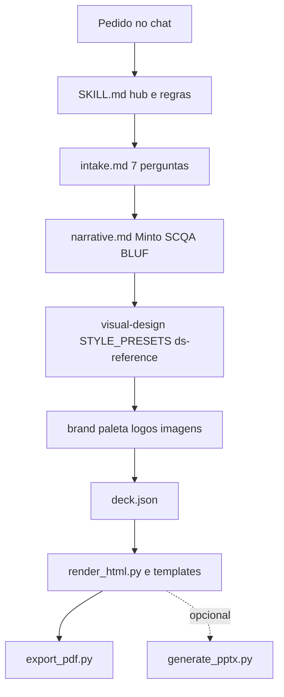

# Skill `executive-presentations` (Cursor)

Apresentações executivas: narrativa (Minto, SCQA, BLUF) + **HTML** (presets, viewport-fit) + **PDF** opcional + **PPTX** opcional.

## Fluxo da skill (como as partes conversam)

Não há várias skills Cursor neste repo — é **uma** skill com módulos em Markdown e scripts em Python. O agente segue este encadeamento:



**Leitura sob demanda:** o agente abre cada `.md` quando o passo exige (ex.: só `intake.md` no início; `STYLE_PRESETS.md` ao escolher preset).

## Trabalho em outro Mac

[SETUP-TRABALHO.md](.cursor/skills/executive-presentations/SETUP-TRABALHO.md) — clone, `venv`, Chrome, pasta `brand/`.

## Marca

[brand/](.cursor/skills/executive-presentations/brand/) — `brand.json` (local, gitignored), `logos/`, `images/`, `reference-decks/`, `examples/board_expansao.json`. Detalhes: [brand/README.md](.cursor/skills/executive-presentations/brand/README.md).

## Instalação e geração

```bash
cd .cursor/skills/executive-presentations
python3 -m venv .venv && source .venv/bin/activate
pip install -r scripts/requirements.txt

python scripts/render_html.py brand/examples/board_expansao.json "/caminho/absoluto/saida.html"
python scripts/export_pdf.py "/caminho/absoluto/saida.html" "/caminho/absoluto/saida.pdf"
```

PPTX: `python scripts/generate_pptx.py scripts/example_deck.json out.pptx` — Previews: `python scripts/preview_styles.py`

## Links rápidos

[SKILL.md](.cursor/skills/executive-presentations/SKILL.md) · [intake.md](.cursor/skills/executive-presentations/intake.md) · [STYLE_PRESETS.md](.cursor/skills/executive-presentations/STYLE_PRESETS.md) · [narrative.md](.cursor/skills/executive-presentations/narrative.md)
